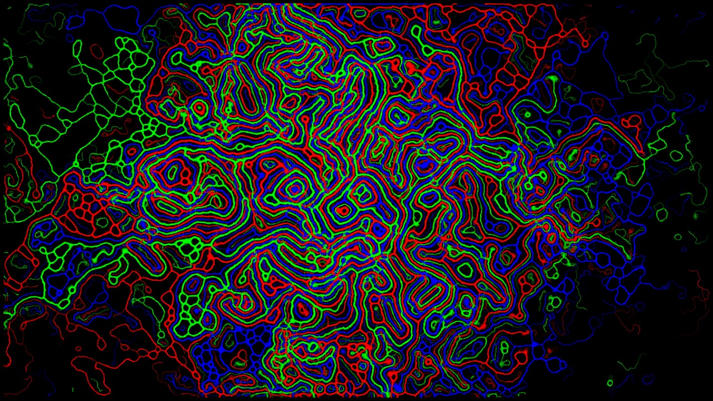

# Slimesim

### Note: no gpu acceleration whatsoever, everything goes on a cpu it's pretty fast though

Personal fun project which was inspired by Sebastian Lague's beautiful [video](https://youtu.be/kzwT3wQWAHE), but became some digital-acid-for-eyes instead

## Building and running
Why would you download something like that at the first place?

Makefile works only for linux because i am lazy, however, should compile in windows too

`make install-dependencies && make run` - yup, that's it

## How to use
Simulation settings can be found at the top of the `main.cpp` file

Yes, you have to rebuild it after every change ( `make run` does that )

Spawning patterns are controlled in a `Swarm` class initialisation, colors are passed at the particular swarm initialisatiion 

^ this might be changed later

Good luck if you will use it!
